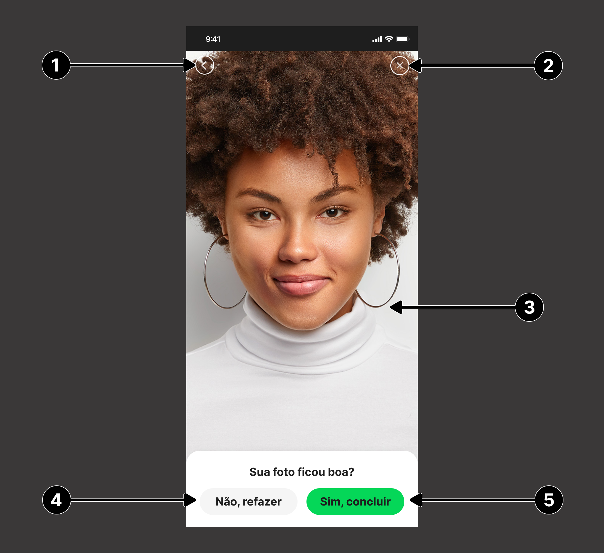

# FaceCaptcha - Guia de customização

O SDK do OILiveness2D permite a customização de todas as telas do fluxo do FaceCaptcha, para isto, é necessária a criação de objetos do tipo `UIView` (via código ou via Interface Builder) que implementem os protocolos definidos para cada tela.

Além das subviews especificadas, a view customizada pode conter outros elementos, apenas tomando cuidado para que os mesmos não interfiram nas subviews funcionais.

### Implementação
Todas as *views* customizadas são passadas via construtor da classe ``FaceCaptchaViewController``. Essas *views* são opcionais, logo não há necessidade de especificar todas, caso não seja necessário.

```swift
let controller = FaceCaptchaViewController(
    appKey: appKey, baseURL: baseURL, delegate: self,
    customInstructionsView: CustomInstructionsView(),
    customLivenessView: CustomLivenessView(),
    customPictureValidationView: CustomPictureValidationView(),
    customProcessResultView: CustomProcessResultView(),
    customResultView: CustomResultView()
)
```

---

## Views Customizadas

### `customInstructionsView`
Essa view deve estar em conformidade com o protocolo ``FaceCaptchaCustomIntructionsView`` que contém os seguintes atributos:

```swift
public protocol FaceCaptchaCustomIntructionsView: UIView {
    var backButton: UIButton! { get }
    var continueButton: UIButton! { get }
}
```

| **Indice** | **Elemento** | **Descrição** |
|:-----------|:-------------|:--------------|
| (**1**) | `backButton` | Botão que fechar o fluxo de recohecimento facial. |
| (**2**) | `continueButton` | Botão que inicia o fluxo de reconhecimento facial. |

<br/>


---

### `customLivenessView`
Essa view deve estar em conformidade com o protocolo ``FaceCaptchaView`` que contém os seguintes atributos:

```swift
public protocol FaceCaptchaView: UIView {
    var cameraPreview: FaceCaptchaCameraPreviewView! { get }
    var cameraOverlay: UIView! { get }
    var backButton: UIButton! { get }
    var closeButton: UIButton! { get }
    var progressView: FaceCaptchaProgressIndicator! { get }
    var instructionLabel: UILabel! { get }
    var challengeIcon: UIImageView! { get }
    var challengeText: UIImageView! { get }
    var recognizingLabel: UILabel! { get }
    var startButton: UIButton! { get }
}
```

| **Indice** | **Elemento** | **Descrição** |
|:-----------|:-------------|:--------------|
| (**1**) | `backButton` | Botão para interromper o desafio e voltar para tela de instruções. |
| (**2**) | `closeButton` | Botão para interromper e fechar o desafio. |
| (**3**) | `instructionLabel` | Label que exibirá as instruções iniciais do desafio. |
| (**4**) | `cameraPreview` | View que exibirá o preview da câmera. |
| (**5**) | `cameraOverlay` | UIView que contém a máscara para o preview da câmera. |
| (**6**) | `startButton` | Botão para iniciar o desafio. |
| (**7**) | `progressView` | View que será exibida em momentos de carregamento e validação. |
| (**8**) | `challengeText` | ImageView que exibirá o texto do desafio. |
| (**9**) | `challengeIcon` | ImageView que exibirá o emoji do desafio. |
| (**10**) | `recognizingLabel` | Label que será exibida durante o processo de reconhecimento da face. |

<br/>
<div>
    
    
</div>
<br/>

**FaceCaptchaCameraPreviewView**

É uma classe customizada que herda de uma `UIView`.

**FaceCaptchaProgressIndicator**

```swift
public protocol FaceCaptchaProgressIndicator: UIView {
    func updateProgress(to newValue: Double)
}
```

| **Elemento** | **Descrição** |
|:-------------|:--------------|
| `updateProgress(to:)` | Método que recebe a porcentagem de carregamento do processo de reconhecimento facial, os valores recebidos variam entre 0.0 e 1.0 |

---

### `customPictureValidationView`
Essa view deve estar em conformidade com o protocolo ``FaceCaptchaCustomPictureValidationView`` que contém os seguintes atributos:

```swift
public protocol FaceCaptchaCustomPictureValidationView: UIView {
    var backButton: UIButton! { get }
    var closeButton: UIButton! { get }
    var retryButton: UIButton! { get }
    var confirmButton: UIButton! { get }
    var capturedImageView: UIImageView! { get }
}
```

| **Indice** | **Elemento** | **Descrição** |
|:-----------|:----------------|:--------------|
| (**1**) | `backButton` | Botão para interromper a validação da imagem capturada e voltar para tela de desafio. |
| (**2**) | `closeButton` | Botão para interromper a validação da imagem capturada e fechar o fluxo do reconhecimento facial. |
| (**3**) | `capturedImageView` | *View* para mostrar a imagem capturada. |
| (**4**) | `retryButton` | Botão para descartar a imagem capturada e refazer o desafio de reconhecimento facial. |
| (**5**) | `confirmButton` | Botão para confirmar a imagem capturada e prosseguir com o processo dela. |

<br/>


---

### `customProcessResultView`
Essa view deve estar em conformidade com o tipo ``FaceCaptchaCustomProcessResultView`` que é um ``typealias`` para o tipo ``UIView``

<br/>


---

### `customResultView`
Essa view deve estar em conformidade com o protocolo ``FaceCaptchaCustomResultView`` que contém os seguintes atributos:

```swift
public protocol FaceCaptchaCustomResultView: UIView {
    var closeButton: UIButton! { get }
    
    func display(_ resultType: FaceCaptchaResultType)
}
```

| **Indice** | **Elemento** | **Descrição** |
|:-----------|:-------------|:--------------|
| (**1**) | `closeButton` | Botão para fechar o fluxo de reconhecimento facial. |
|         | `display(_:)` | Esse método recebe como parâmetro um `enum` do tipo `FaceCaptchaResultType` que indica qual resultado deve ser mostrado, cada caso desse enum contém um objeto com informações detalhadas do resultado. |

<br/>

**FaceCaptchaResultType**

```swift
public enum FaceCaptchaResultType {
    case success(FaceCaptchaSuccessModel)
    case error(FaceCaptchaError)
}
```
<br/>

| **Tipo de resultado** | **Exemplo de tela** |
|:----------------------|:--------------------|
| Sucesso |  |
| Erro |  |