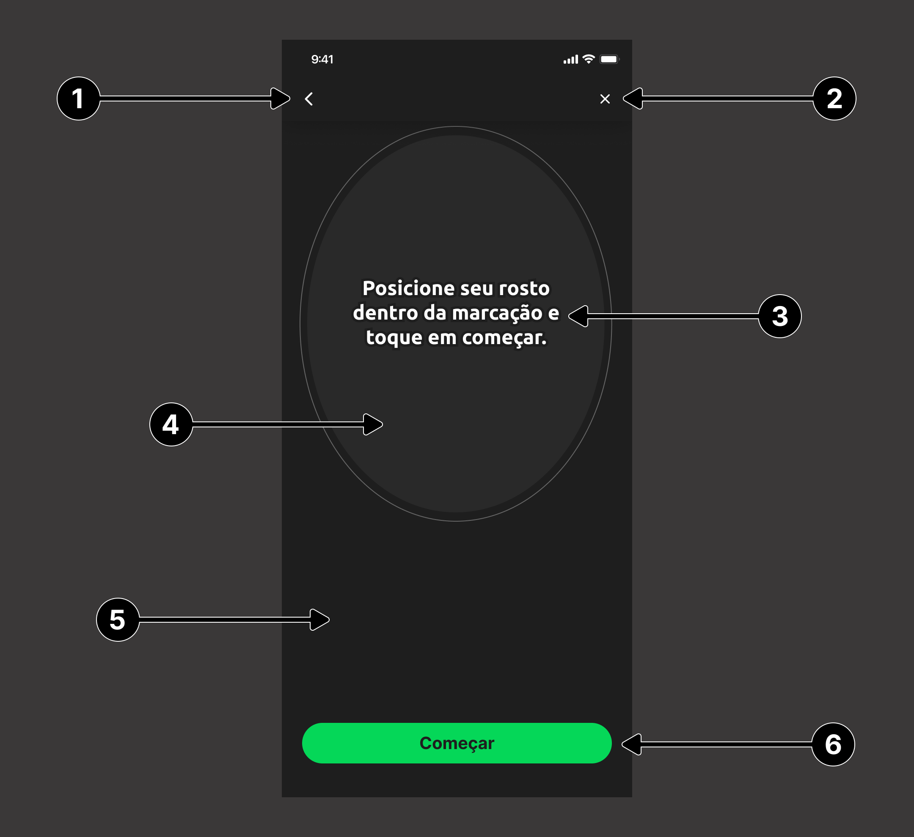
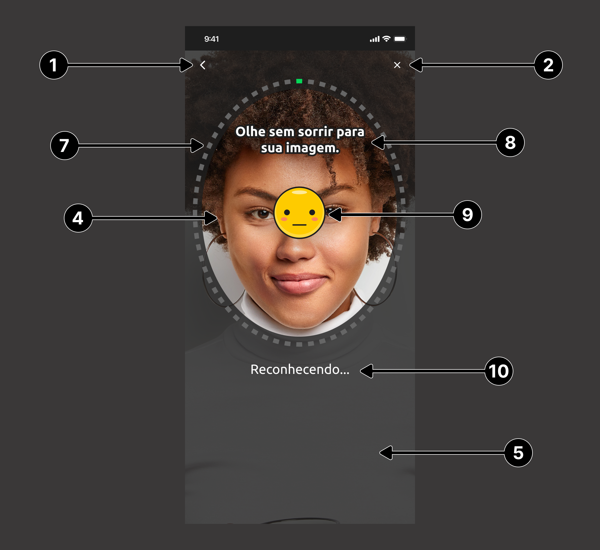
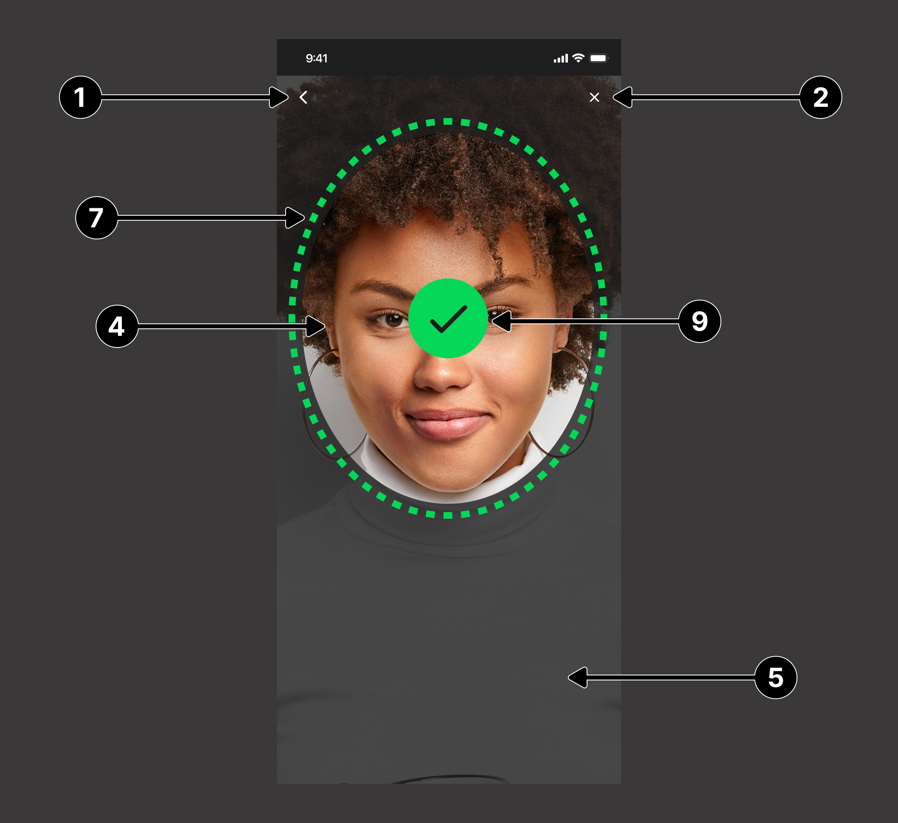

# Guia de customização - FaceCaptcha

O SDK do OILiveness2D permite a customização de todas as telas do fluxo do FaceCaptcha, para isto, é necessária a criação de objetos do tipo `UIView` (via código ou via Interface Builder) que implementem os protocolos definidos para cada tela.

Além das subviews especificadas, a view customizada pode conter outros elementos, apenas tomando cuidado para que os mesmos não interfiram nas subviews funcionais.

### Implementação
Todas as *views* customizadas são passadas via construtor da classe ``FaceCaptchaViewController``. Essas *views* são opcionais, logo não há necessidade de especificar todas, caso não seja necessário.

```swift
let controller = FaceCaptchaViewController(
    appKey: appKey, 
    baseUrl: baseUrl, 
    delegate: self,
    customInstructionsView: CustomInstructionsView(),
    customLivenessView: CustomLivenessView(),
    customProcessResultView: CustomProcessResultView(),
    customResultView: CustomResultView(),
    customCameraPermissionView: CustomCameraPermissionView()
)
```

**Caso qualquer um seja `nil`, será usado o *layout* padrão.**

---

## 1. Tela de instruções para prova de vida

### `customInstructionsView`
Essa view deve estar em conformidade com o protocolo ``FaceCaptchaCustomIntructionsView`` que contém os seguintes atributos:

```swift
public protocol FaceCaptchaCustomIntructionsView: UIView {
    var backButton: UIButton! { get }
    var continueButton: UIButton! { get }
}
```

| **Indice** | **Elemento** | **Descrição** |
|:-----------|:-------------|:--------------|
| (**1**) | `backButton` | Botão que fechar o fluxo de recohecimento facial. |
| (**2**) | `continueButton` | Botão que inicia o fluxo de reconhecimento facial. |

<br/>


---

## 2. Tela de liveness

### `customLivenessView`
Essa view deve estar em conformidade com o protocolo ``FaceCaptchaCustomView`` que contém os seguintes atributos:

```swift
public protocol FaceCaptchaCustomView: UIView {
    var cameraPreview: FaceCaptchaCameraPreviewView! { get }
    var cameraOverlay: UIView! { get }
    var backButton: UIButton! { get }
    var closeButton: UIButton! { get }
    var progressView: UIView! { get }
    var instructionLabel: UILabel! { get }
    var challengeIcon: UIImageView! { get }
    var challengeText: UIImageView! { get }
    var recognizingLabel: UILabel! { get }
    var startButton: UIButton! { get }

    func updateProgress(to newValue: Double)
    func setInstructionLabelTitle(to newTitle: String)
}
```

| **Indice** | **Elemento**                    | **Descrição** |
| :--------- | :------------------------------ | :-------------- |
| (**1**)    | `backButton`                    | Botão para interromper o desafio e voltar para tela de instruções. |
| (**2**)    | `closeButton`                   | Botão para interromper e fechar o desafio. |
| (**3**)    | `instructionLabel`              | Label que exibirá as instruções iniciais do desafio. |
| (**4**)    | `cameraPreview`                 | View que exibirá o preview da câmera. |
| (**5**)    | `cameraOverlay`                 | UIView que contém a máscara para o preview da câmera. |
| (**6**)    | `startButton`                   | Botão para iniciar o desafio. |
| (**7**)    | `progressView`                  | View que será exibida em momentos de carregamento e validação. |
| (**8**)    | `challengeText`                 | ImageView que exibirá o texto do desafio. |
| (**9**)    | `challengeIcon`                 | ImageView que exibirá o emoji do desafio. |
| (**10**)   | `recognizingLabel`              | Label que será exibida durante o processo de reconhecimento da face. |
|            | `updateProgress(to:)`           | Método que recebe a porcentagem de carregamento do processo de reconhecimento facial, os valores recebidos variam entre 0.0 e 1.0. |
|            | `setInstructionLabelTitle(to:)` | Método que altera o titulo da propriedade `instructionLabel`. |

<br/>
<div>
    
    
    
</div>
<br/>

**FaceCaptchaCameraPreviewView**

É uma classe customizada que herda de uma `UIView`.

---

## 3. Tela de processamento dos desafios

### `customProcessResultView`
Essa view deve estar em conformidade com o tipo ``FaceCaptchaCustomProcessResultView`` que é um ``typealias`` para o tipo ``UIView``

<br/>


---

## 4. Tela de resultado da prova de vida

### `customResultView`
Essa view deve estar em conformidade com o protocolo ``FaceCaptchaCustomResultView`` que contém os seguintes atributos:

```swift
public protocol FaceCaptchaCustomResultView: UIView {
    var closeButton: UIButton! { get }
    
    func display(_ resultType: FaceCaptchaResultType)
}
```

| **Indice** | **Elemento** | **Descrição** |
|:-----------|:-------------|:--------------|
| (**1**) | `closeButton` | Botão para fechar o fluxo de reconhecimento facial. |
|         | `display(_:)` | Esse método recebe como parâmetro um `enum` do tipo `FaceCaptchaResultType` que indica qual resultado deve ser mostrado, cada caso desse enum contém um objeto com informações detalhadas do resultado. |

<br/>

**FaceCaptchaResultType**

```swift
public enum FaceCaptchaResultType {
    case success(FaceCaptchaSuccessModel)
    case error(FaceCaptchaError)
}
```
<br/>

| **Tipo de resultado** | **Exemplo de tela** |
|:----------------------|:--------------------|
| Sucesso |  |
| Erro |  |

---

## 5. Tela de permissão da câmera

### `customCameraPermissionView`

Essa view deve estar em conformidade com o protocolo ``DocumentscopyCustomCameraPermissionView`` que contém os seguintes atributos:

```swift
public protocol DocumentscopyCustomCameraPermissionView: UIView {
    var backButton: UIButton! { get }
    var checkPermissionButton: UIButton! { get }
    var openSettingsButton: UIButton! { get }
    var closeButton: UIButton! { get }
    
    func showBottomSheet(visibility: Visibility)
}
```

| **Indice** | **Elemento** | **Descrição** |
|:-----------|:-------------|:--------------|
| (**1**) | `backButton` | Botão para função voltar da navegação. |
| (**2**) | `checkPermissionButton` | Botão responsável por verificar a permissão de câmera e solicitá-la se necessário. |
| (**3**) | `openSettingsButton` | Botão que redireciona o usuário para o menu de permissões do aplicativo na configurações do dispositivo. |
| (**4**) | `closeButton` | Botão que fecha o fluxo de validação da permissão de câmera e volta para tela anterior. |
|         | `showBottomSheet(visibility:)` | Método responsável por indicar o momento de mostrar os botões de ``openSettingsButton`` e ``closeButton``, podendo receber dois valores: **hidden** (esconder os botões) e **displayed** (mostrar os botões). |

<br/>
<div>
    
    
<div/>