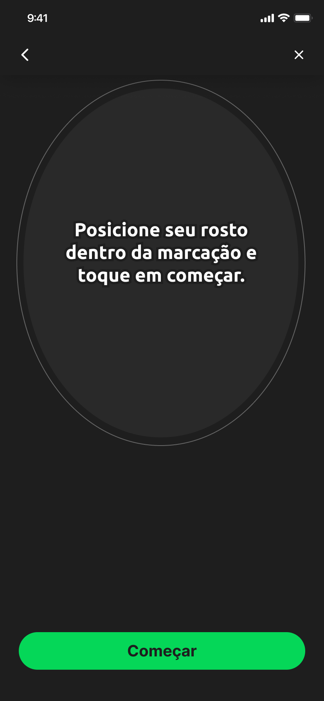

# Fluxo de telas - FaceCaptcha 

O fluxo de telas do FaceCaptcha **é dividido em 8 telas**:

### 1. Tela de instruções para prova de vida
O usuário terá acesso a instruções sobre como executar o processo de prova de vida da melhor forma:

### 2. Tela de instrução inicial para o processo de prova de vida
O usuário será informado sobre como posicionar o rosto na câmera do dispositivo para poder iniciar o processo de prova de vida:

### 3. Tela de reconhecimento dos desafios
Será mostrado ao usuário alguns desafios para serem cumpridos e validados posteriormente:

### 4. Tela de desafio reconhecido
Toda vez que um desafio for finalizado será mostrado um efeito visual, caso ainda haja outros desafios a serem cumpridos, estes serão mostrados em sequência:

### 5. Tela de processamento dos desafios
Ao final de todos os desafios será mostrada uma tela de carregamento, onde é feito processamento das imagens capturadas durante a prova de vida:

### 6. Tela de resultado da prova de vida (SUCESSO)
Após o processamento dos desafios será mostrada a tela sucesso, caso os desafios tenham sido reconhecidos e validados pelo backend:

### 7. Tela de resultado da prova de vida (Erro)
Após o processamento dos desafios será mostrada a tela erro, caso os desafios não tenham sido reconhecidos ou validados pelo backend:

### 8. Tela para solicitar a permissão da câmera do dispositivo
Antes do passo 2 (Tela de captura do documento (frente)), o usuário será notificado caso a permissão para acessar a câmera estiver desativada:

### 8.1. Tela com alerta de solicitação da permissão da câmera
Ao clicar no botão **Verificar** do passo anterior, o dispositivo apresenta um alerta na tela com a mensagem de solicitação da câmera:

**Obs.:** Por padrão, a Apple apresenta essa mensagem de solicitação apenas uma vez. Nas próximas vezes, o usuário terá que ir até a tela de configurações para dar permissão para a câmera manualmente.

### 8.2. Tela de instrução para direcionar o usuário para tela de configuração para permitir o uso da câmera:
Caso a solicitação seja recusada pelo usuário, neste passo é apresentado a mensagem para direciona-lo às configurações:

